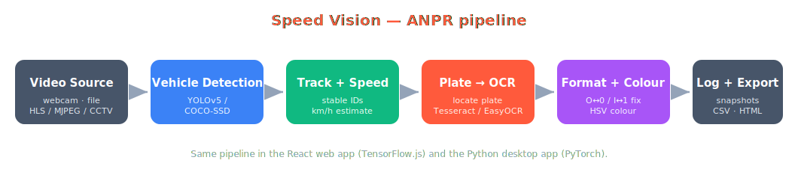

<div align="center">

# 🚗 Speed Vision — ANPR System

**Detect vehicles, read number plates, estimate speed, and identify vehicle colour — from any video, webcam, or live CCTV stream.**

Two implementations sharing the same logic: a **zero-install React web app** that runs entirely in the browser, and an upgraded **Python desktop app** (PyQt5 + YOLOv5 + EasyOCR).


</div>

---

## Overview

Speed Vision is an **Automatic Number Plate Recognition (ANPR)** system built for the
LENSXplore *Speed Vision* problem statement. It processes a video stream and, for every
vehicle, produces: a tracked bounding box, an estimated **speed**, the recognised
**number plate**, and the **vehicle colour** — with a live dashboard and exportable logs.

| Requirement | Implemented with |
|---|---|
| Real-time video processing | Browser `requestAnimationFrame` loop / OpenCV capture |
| Vehicle detection | TensorFlow.js **COCO-SSD** · optional trainable **YOLOv5/v8** · (Python) YOLOv5 |
| Plate localisation | Classic CV (edge → morphology → contours) **or** a trained YOLO plate model |
| Number-plate OCR | **Tesseract.js** (web) / **EasyOCR** (desktop) on the localised crop |
| Speed estimation | Centroid tracker with stable IDs + pixel→metre calibration |
| Colour detection (bonus) | HSV body-region analysis with shade-aware names |
| Plate-format validation | Country templates auto-correct OCR confusions (O↔0, I↔1, S↔5…) |
| Evidence & export | Per-vehicle snapshots, CSV log, HTML report |

## Architecture

<div align="center">



</div>

The pipeline is identical across both apps: **detect → track → estimate speed → detect
colour → localise plate → OCR → validate format → log**.

## Screenshots

_Captured from the live app — see [`docs/screenshots`](docs/screenshots)._

<!-- Added after the first deploy:


-->


## Repository structure

```
.
├── web/            # React web app (browser-only, no backend)
│   ├── src/lib/    #   detector, tracker, colour, plate locator, plate model, OCR, format
│   ├── src/hooks/  #   useAnpr — the full pipeline loop
│   └── src/components/
├── python/         # VisionDrive Pro — PyQt5 + YOLOv5 + EasyOCR desktop app
│   └── vd/         #   tracker, colour, plate locator, plate format, OCR modules
├── training/       # Train a YOLO plate model and export to TF.js
├── docs/           # Architecture diagram, comparison notes
└── .github/        # CI workflow
```

## Quick start

### 🌐 Web app (recommended — runs in your browser)

```bash
cd web
npm install
npm run dev          # open the printed http://localhost:5173 URL
```

The first run downloads the detection model and OCR data in the browser. Pick a source
(webcam / video file / live HLS-MJPEG stream), press **Run**, and watch the live overlay
and detection log. Build for production with `npm run build`.

No clip handy? Grab a sample traffic video and use the **Load sample video** button:

```bash
bash tools/fetch_sample_video.sh     # downloads web/public/sample.mp4
```

➡️ Full web docs: [`web/README.md`](web/README.md)

### 🖥️ Desktop app (Python)

```bash
cd python
pip install -r requirements.txt
python visiondrive_pro.py
```

First launch pulls YOLOv5 weights via `torch.hub`. Load a video (or use the webcam),
tune calibration / speed limit / plate format, and export the CSV log; snapshots are
saved to `captures/`.

➡️ Full desktop docs: [`python/README.md`](python/README.md)

## Deploy to Vercel

The web app deploys as a static site:

1. Push this repo to GitHub.
2. On [vercel.com](https://vercel.com) → **Add New → Project** → import the repo.
3. Set **Root Directory** to `web` (Vercel auto-detects Vite: build `npm run build`,
   output `dist`).
4. **Deploy**. Add the sample video first (`bash tools/fetch_sample_video.sh`, then
   commit) so the live demo has a clip to run.

## Live cameras & CCTV

- **Webcam / phone** — built in (browser permission or OpenCV device 0).
- **HLS** (`.m3u8`) and **MJPEG** stream URLs — paste into the web app's Live tab.
- **RTSP CCTV** — browsers can't play RTSP directly; bridge it to HLS first:
  ```bash
  ffmpeg -i rtsp://CAM_IP:554/stream -c:v libx264 -f hls -hls_time 2 \
         -hls_flags delete_segments stream.m3u8
  ```
  (or use [MediaMTX](https://github.com/bluenviron/mediamtx)) and paste the `.m3u8` URL.

## Train your own plate detector

For sharper plate reads than the built-in CV localizer, train a YOLO model and load it
in the web app at runtime (TF.js):

```bash
cd training
pip install -r requirements.txt
python train_plate_yolo.py --epochs 100      # exports to TF.js automatically
```

See [`training/README.md`](training/README.md) for datasets, export, and serving.

## Accuracy notes

- **Speed** depends on the `metres-per-pixel` calibration and camera angle. Calibrate
  against a known real distance visible in the frame for best results.
- **Plates** read best when front/rear, reasonably close, and well lit. The trained YOLO
  model + format validation greatly reduces false reads.

## Roadmap

- [ ] Trained YOLO plate model option in the Python app (parity with web)
- [ ] Region-of-interest line for traffic counting
- [ ] Optional Python OCR microservice for the web app (EasyOCR-grade reads)

## Credits

Built by **Team Vision Drive**. Evolved from the original
[VisionDrive](https://github.com/Aman-2305/VisionDrive) desktop prototype — see
[`docs/COMPARISON.md`](docs/COMPARISON.md) for the full parity and improvements list.

## License

[MIT](LICENSE) © 2026 Vision Drive Team
